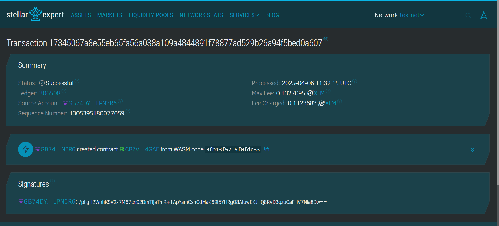

# Automated Royalties for Creators

## Project Title
Automated Royalties for Creators

## Project Description
The Automated Royalties for Creators smart contract provides a decentralized solution for creative professionals to receive fair compensation for their work. Built on the Soroban platform using the Stellar blockchain, this contract enables transparent tracking of ownership, automated royalty distribution, and simplified licensing management.

This smart contract system allows creators to register their digital works, set customizable royalty percentages, and automatically receive payments when their content is used, licensed, or resold. The system is designed to empower artists, musicians, writers, and other creative professionals by ensuring they receive proper compensation for their work, eliminating the need for intermediaries, and providing transparent tracking of ownership and usage rights.
## Contract Address details :
CBZVR4C4WUVFLFHU2T2IOCYGWGSQFZNPQJ7QJYMSCLP7JT6GYO224GAF

## Project Vision
Our vision is to revolutionize how creators manage their intellectual property and receive compensation for their work. In traditional creative industries, artists often struggle to track usage of their work and collect rightful royalties. Intermediaries typically take significant cuts, and payment processes can be slow and opaque.

By leveraging blockchain technology through the Soroban platform, we aim to:
- Create a more equitable ecosystem for creators
- Streamline royalty collection and distribution
- Provide transparent tracking of content usage
- Eliminate unnecessary intermediaries
- Enable global access to creative works with fair compensation

This project serves as a bridge between the creative economy and decentralized finance, opening new opportunities for creators worldwide to maintain control over their work and receive proper recognition and compensation.

## Key Features

### Creator Registration and Work Registration
- Simple interface for creators to register their profile and works
- Secure storage of creator identity and work metadata
- Support for various creative works (digital art, music, writing, etc.)
- Option to include sample previews and work descriptions

### Flexible Royalty Configuration
- Customizable royalty percentages for different usage types
- Multi-tiered royalty structures for primary and secondary sales
- Time-based royalty options (perpetual or fixed-term)
- Revenue splitting for works with multiple creators

### Automated Payment Distribution
- Instant royalty payments upon content usage or license purchase
- Transparent transaction history for both creators and users
- Support for multiple payment methods and currencies
- Automatic conversion to creator's preferred currency

### Licensing Management
- Self-executing license agreements through smart contracts
- Customizable license terms for different usage scenarios
- Easy verification of license authenticity
- Ability to revoke licenses for terms violations

### Usage Tracking and Analytics
- Detailed tracking of how and where content is being used
- Analytics dashboard for creators to monitor performance
- Usage reports for better business decision-making
- Identification of unauthorized usage

### Marketplace Integration
- Seamless integration with existing NFT and digital content marketplaces
- API for third-party platform integration
- Mobile-friendly interface for on-the-go management
- Social sharing capabilities to increase work visibility

### Governance and Community Features
- Voting mechanisms for platform improvements
- Community forums for creators to connect and collaborate
- Dispute resolution processes
- Educational resources for maximizing contract benefits